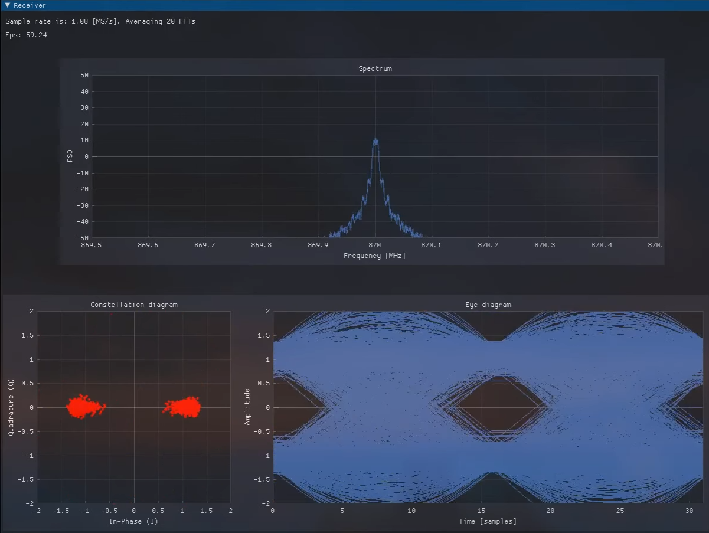

# BPSK Transmitter and Receiver for PlutoSDR

This repository contains a basic implementation of a BPSK transmitter and receiver designed for use with the PlutoSDR platform. The code enables simple packet transmission and reception, including flow synchronization using a defined sync word.

## Overview

- **Transmitter**: Generates BPSK modulated signals based on input bit sequences or text.  
  **Note:** The transmitter is very simple and needs polishing. I believe there is a sharp discontinuity at the end of the packet because I just repeat the samples, which may cause some "noise" in the IQ constellation.

- **Receiver**: Performs BPSK demodulation, including synchronization using a predefined sync word to handle basic packet framing.

## Background and Source

This project is based on the code by Paulo Dutra (PU4THZ) from this post:  
https://x.com/DutraCGI/status/1649999065474641924

### Bug Fix

I corrected a bug in the original implementation that caused the Mueller-Muller loop to lose lock of the timing synchronization, adversely affecting the stability and accuracy of the receiver’s timing recovery. This fix improves the robustness of the synchronization and packet handling.

You can read more about the bug here:  
https://x.com/gaoterop/status/1760787898398343671

## Usage

The code is intended to be used with PlutoSDR hardware. It provides a foundation for experimenting with BPSK modulation and demodulation with packet synchronization.

## YouTube Video

Click on the image below to watch a video of the modem in action.

  

---

Gabriel
